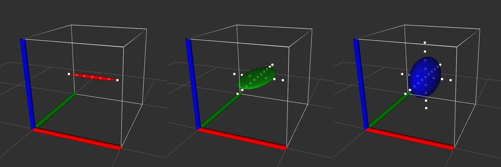
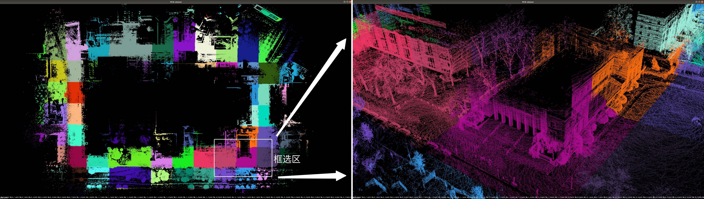

# Incremental NDT-OMP algorithm (iNDT)

*Note: This README file has both **Chinese version** and **English version**, for English version please scroll down.*

**目录/Contents:**

  - 【中文版】
  - [**一、简介**](#一、简介)
  - [**二、编译与运行**](#二、编译与运行)
  - [**三、核心接口与调用方法**](#三、核心接口与调用方法)
  - [**四、应用示例（demo & Localization）**](#四、应用示例（demo-&-Localization）)
  - [**五、相关仓库**](#五、相关仓库)
  - 【English Version】
  - [**1. Introduction**](#1.-Introduction)
  - [**2. Compile and Run**](#2.-Compile-and-Run)
  - [**3. Interfaces and Usage**](#3.-Interfaces-and-Usage)
  - [**4. Application Examples (LIO & Localization)**](#4.-Application-Examples-(LIO-&-Localization))
  - [**5. Related packages**](#5.-Related-packages)


## 一、简介

一种快速且优雅的 **增量式NDT算法** 开源实现 —— A Fast and Elegant Implementation of **Incremental NDT algorithm (iNDT)** based on ndt_omp。

NDT（Normal Distribution Transform）是一种基础的点云配准算法，它将一帧点云（source）对齐到另一帧点云（target）上。
通常，NDT 算法需要先将 target 点云投影到体素空间（voxel）中，并对每一个体素内的点云拟合高斯分布；
而后，NDT对 source 点云中的每一个点寻找若干个最近邻voxel，并利用这些最近邻voxel中的高斯分布来构建残差和雅可比，借助L-M优化算法实现梯度下降，通过多次迭代，获得最终的配准位姿。

传统NDT算法有两个耗时较高的环节可以被优化：
1. 每次NDT配准时都需要重新对target点云进行体素空间投影和高斯化，即使当前target和上一个target相差不大；
2. 每次重置target点云后，都需要重新生成kdtree，以满足为source点云中的点查找最近邻voxel的需求。

针对上述问题，本仓库在[ndt_omp](https://github.com/koide3/ndt_omp)的基础上，实现了增量式的NDT算法，**我们使用哈系表持有和维护所有的voxels，实现了增量式地加载和卸载voxel对象，并在单个voxel内实现了高斯分布的增量式更新算法**，从而**避免了重复性地重构voxel地图，且无需构建kdtree即可实现近邻voxel查询，大大提升了效率**。根据实验对比，在以NDT为基础的LIO应用中，iNDT(with omp) 的计算速度是传统 NDT(with omp) 的xx倍。（未完待续...）

*TODO: 实验对比（耗时） ...*

*TODO: iNDT基本功能演示 ...*


本仓库部分子目录简介：
```
.
├── apps  ------------  // 原ndt_omp官方demo
├── data  ------------  // demo data
├── include  ---------  // 头文件
├── ros_examples  ----  // 本仓库提供的iNDT demo【iNDT官方应用示例】
│   ├── run_indt_loc_demo.cpp
│   ├── run_update_voxel_distrib_demo.cpp
│   ├── run_update_voxel_map_distrib_demo.cpp
│   ├── rviz
│   └── utils
└── src  -------------  // 源文件
```


## 二、编译与运行

依赖：本工程依赖于 ROS 和 PCL，大家应该很容易自行配置。个人开发和测试环境为 ubuntu18.04 和 ROS melodic，但其它环境（如ubuntu16或20）应该也能正常编译运行。
 
### 编译

编译过程非常简单，如下：

```
git clone https://github.com/KennyWGH/indt_omp.git
cd indt_omp
mkdir build && cd build
cmake ..
make
```


### 运行“高斯分布增量式更新”示例程序

在3个窗口中分别执行如下命令：
```
roscore
rviz -d ros_examples/rviz/update_voxel_distrib.rviz
./build/devel/lib/ndt_omp/run_update_voxel_distrib_demo
```

如果一切顺利，您将在rviz界面中看到3组结果依次展示出来，如下图所示。

<br>
*图：高斯分布的增量式更新（从左至右，voxel中不断新增点云，高斯分布随之更新）*


### 运行“iNDT-Localization”示例程序【核心示例】

在4个窗口中分别执行如下命令：
```
roscore
rviz -d ros_examples/rviz/indt_loc.rviz
./build/devel/lib/ndt_omp/run_indt_loc_demo
rosbag play campus_large_dataset.bag -r 0.8
```

<br>
*图：iNDT-Localization 配套的点云地图（已切分为瓦片地图，按颜色区分显式，便于动态加载和卸载）*
<!-- Description: xxx -->

*TODO: 未完待续 ...*


## 三、核心接口与调用方法

如果你已经运行过我提供的demo程序，现在应该已经对 iNDT 有一些直观认识了。

如果您希望作为开发者来使用 iNDT，我在这里对iNDT的核心接口做了一一说明，应该会对您有所帮助。

iNDT类名： **pclomp::IncrementalNDT**

核心接口（传统部分，继承自基类pcl::Registration，或来自ndt_omp）：
- **setResolution()** 设置voxel分辨率
- **setMaximumIterations()** 设置允许的最大迭代次数 
- **setNeighborhoodSearchMethod()** 设置最近邻规则
- **setNumThreads()** 设置omp加速线程数 
- **....** 
- **setInputTarget()** 设置target点云（内部已实现增量式，也即：该接口实质上是在增量式地更新voxel地图；我希望这个过程是无感的，因此重载了原有接口）
- **setInputSource()** 设置source点云
- **align()** 执行一次NDT配准


核心接口（新增部分，主要用来设置incremental行为模式）：

- **enableIncrementalMode()** 开启、关闭增量式模式，若关闭则回退到常规ndt_omp
- **setSpatialBoundingBoxForVoxels()** 设置voxel地图的范围，超过此范围的voxel将被自动卸载
- **setAutoTrimEveryNMeters()** 开启、关闭自动卸载voxel模式，以及设置触发条件
- **enableInLeafDownsample()** 开启、关闭体素内的‘体素降采样’，若开启可控制插入点的密度
- **getInLeafPointCloud()** 获取整个地图的voxel中的点云，仅在开启InLeafDownsample后有效
- **getDisplayCloud()** 获取整个地图的voxel中的点云（采样高斯分布生成的虚拟点云）
- **getVoxelsData()** 获取整个地图的voxels，包含voxel的索引、坐标、高斯分布、特征值/特征向量等
- **setVerboseMode()** 是否打印更详细的日志，及日志等级

*TODO: 未完待续 ...*


## 四、应用示例（demo & Localization）

<!-- usage and applications | 调用方法和应用示例 -->

*TODO: 未完待续 ...*


## 五、相关仓库

- [ndt_omp](https://github.com/koide3/ndt_omp)
- [fast_gicp](https://github.com/SMRT-AIST/fast_gicp)


## 1. Introduction
Coming soon ...

## 2. Compile and Run
Coming soon ...

*`iNDT-Localization demo`*

*`run_update_voxel_distribution demo`*

*`run_update_voxel_map_distribution demo`*

## 3. Interfaces and Usage
Coming soon ...

## 4. Application Examples (LIO & Localization)
Coming soon ...

## 5. Related packages
- [ndt_omp](https://github.com/koide3/ndt_omp)
- [fast_gicp](https://github.com/SMRT-AIST/fast_gicp)
